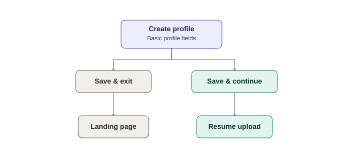
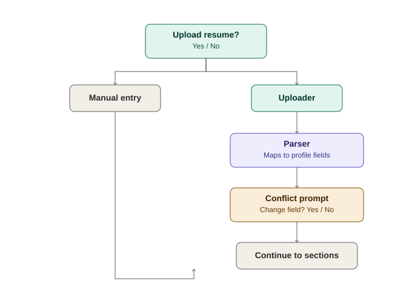
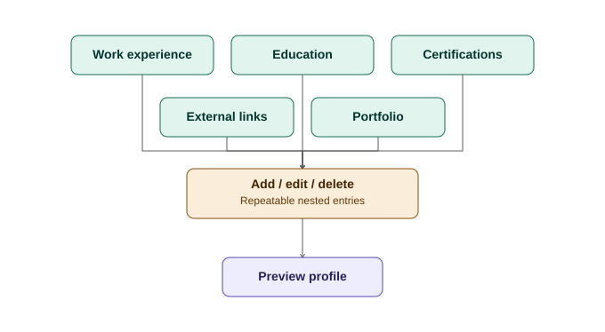
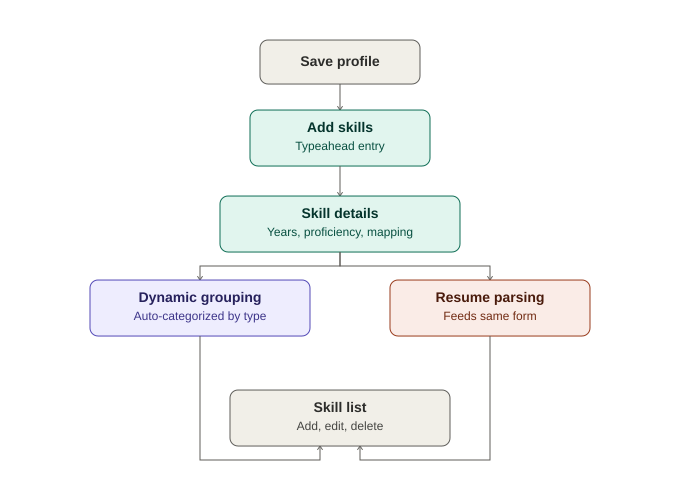

# Candidate Profile Creation Workflow — Spec

**Status:** Draft — not yet built. Written up for sequencing into Sprint tickets later.

## Overview

This describes the full candidate onboarding flow: creating a profile, optionally
uploading and parsing a resume, building out Work Experience / Education /
Certifications / Links / Portfolio, previewing the profile, and adding Skills.

---

## 1. Create Profile (Step 1)



Basic fields:
- Name
- Email
- Headline
- Summary (**rich text editor** — formatting/markup, not plain textarea)
- Password

Actions:
- **Save and Exit** → returns to Landing Page
- **Save and Continue** → advances to Resume Upload step

---

## 2. Resume Upload (Step 2)



- Prompt: Upload Resume? **Yes / No**
- If **Yes**: uploader is displayed
  - Accepted formats: standard resume formats (PDF, DOCX, etc.) **plus Mac Pages format**
- If **No**: skip to Work Experience / Education / Certifications entry manually

---

## 3. Resume Parser

When a resume is uploaded, the parser extracts and maps to:

- Name
- Email
- Location
- Work History
- Education
- Certifications
- Summary
- Headline
- Additional Information
- Portfolio
- External Links

### Conflict handling

For any field that **already has manually-entered data** and the parser produces a
**different value**, show a per-field confirmation prompt:

> "Change this from **[manually entered value]** to **[parsed value]**? Yes / No"

- **Yes** → replace with parsed value
- **No** → keep the manually entered value

This is a field-by-field prompt, not a single bulk confirmation.

---

## 4. Dynamic Section Forms



Once the parser (or manual entry) populates data, additional form sections open
beneath the core Profile fields. Each section renders as many entries/lines as
needed, and supports **add / edit / delete** per entry.

### 4a. Work Experience

Repeatable nested entries. Each entry:

```
Job Title:
Company:
Location:
Dates:
Details:   (rich text editor — same as Summary)
```

- The **most recent** entry gets a **"Currently work here"** checkbox
  (standard pattern — when checked, disables/hides the end date field)
- Add / edit / delete per entry

### 4b. Education

Same nested repeatable pattern as Work Experience — its own form, each entry
editable, with add/edit/delete.

*(Field-level detail TBD — likely School, Degree, Field of Study, Dates)*

### 4c. Certifications

Same nested repeatable pattern — own form, add/edit/delete per entry.

**Future sprint note:** add API-based validation to confirm certifications are
still active, where a validation API exists. Explore whether the same is
possible for Education (degree verification). Not in scope for this build.

### 4d. External Links

- Up to **5** links
- Each: add / edit / delete

### 4e. Portfolio

Either:
- **File upload** — same accepted formats as resume upload, **plus image formats**
- **OR** a Link + description

---

## 5. Profile Preview

A "Preview" action generates a read-only view showing the candidate's profile
**as an employer would see it**.

---

## 6. Save Profile → Add Skills (Step 3)



After the candidate saves their profile, the next workflow step is **Add Skills**.

### Skill entry

- Typeahead/autocomplete input against the skills database as the candidate types
- If the skill isn't found, candidate can enter a new/custom skill
- Required per skill:
  - Years used
  - Proficiency level
  - Mapping to one or more Work History entries the skill was used in

### Dynamic grouping

Skills are automatically grouped by category (e.g. Development skills grouped
together, Project Management skills grouped together, etc.) — grouping logic
determines category, candidate doesn't manually categorize.

### Display

- Each added skill displays below the entry form
- Candidate can continue to add / edit / delete skills from that list

### Resume parsing tie-in

If the uploaded resume has a Skills section, it should be parsed and fed into
this same Skills form (subject to the same conflict-prompt pattern as Section 3
where applicable).

---

## Open Questions / Not Yet Decided

- Exact field list for Education entries
- Rich text editor library choice (for Summary and Work Experience Details)
- Skills database structure / how grouping categories are defined and maintained
- Whether "Additional Information" is its own free-form section or folded into Summary
- File size/type limits for resume and portfolio uploads
- Whether Mac Pages parsing requires a separate parser path or format conversion first

---

## Sequencing Note

This is multi-sprint scope, not a single feature. Per the "build one feature per
day" cadence, this should be broken into small, independently shippable tickets
(e.g. Create Profile form → Resume upload UI → Parser integration → Work History
CRUD → Education CRUD → Certifications CRUD → Links → Portfolio → Preview →
Skills form) rather than built as one branch.
